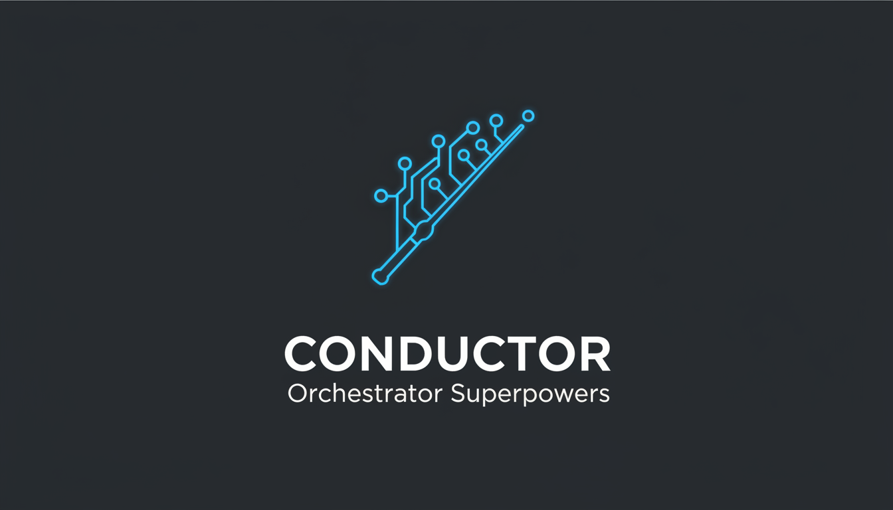
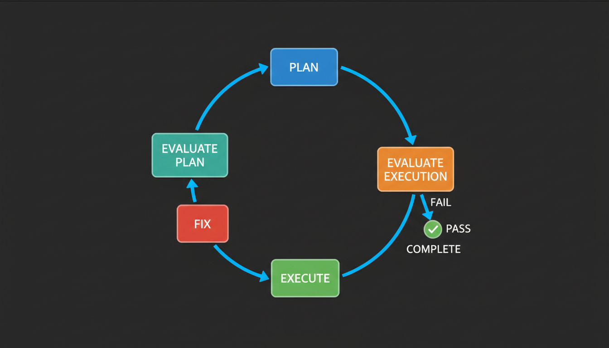
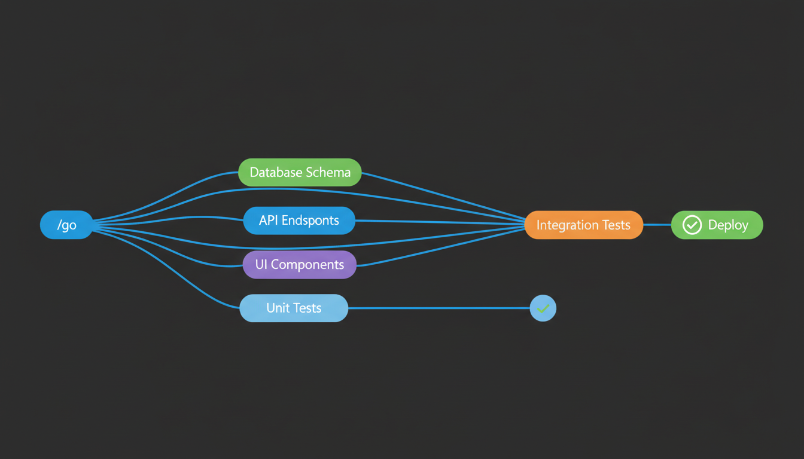
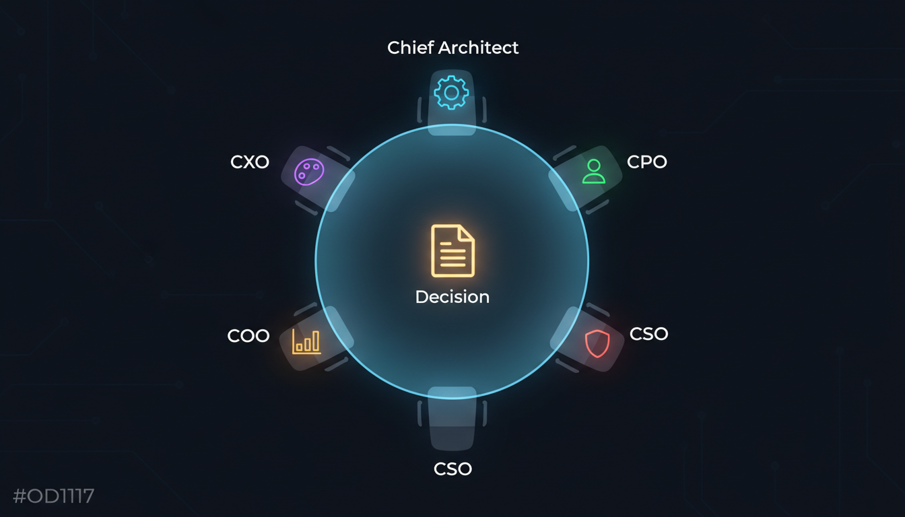

<p align="center">
  
</p>

<p align="center">
  <strong>Multi-agent orchestration for Claude Code</strong><br/>
  Parallel execution &bull; Automated quality gates &bull; Board of Directors
</p>

<p align="center">
  <a href="https://github.com/Ibrahim-3d/conductor-orchestrator-superpowers/blob/main/LICENSE"></a>
  <a href="https://github.com/Ibrahim-3d/conductor-orchestrator-superpowers"></a>
  <a href="https://docs.anthropic.com/en/docs/claude-code"></a>
  <a href="https://github.com/obra/superpowers"></a>
</p>

<p align="center">
  <a href="#installation">Installation</a> &bull;
  <a href="#quick-start">Quick Start</a> &bull;
  <a href="#the-evaluate-loop">How It Works</a> &bull;
  <a href="#commands">Commands</a> &bull;
  <a href="#architecture">Architecture</a> &bull;
  <a href="#license">License</a>
</p>

---

## What is this?

Conductor turns Claude Code into a **structured engineering team**. Instead of ad-hoc coding, it organizes work into tracks with specs, plans, parallel execution, and automated evaluation.

**One command. Full automation.**

```bash
/go Add user authentication with OAuth
```

That single command triggers the full lifecycle — spec, plan, execute, evaluate, fix — without any manual handoffs.

## What's Included

| Component | Count | Highlights |
|-----------|------:|------------|
| **Agents** | 16 | Orchestrator, loop agents, board directors, executive advisors, workers |
| **Skills** | 42 | Planning, execution, evaluation, debugging, TDD, code review |
| **Commands** | 22 | `/go`, `/conductor`, `/board-meeting`, `/cto-advisor`, and more |
| **Evaluators** | 4 | UI/UX, Code Quality, Integration, Business Logic |
| **Board of Directors** | 5 | Chief Architect, CPO, CSO, COO, CXO |
| **Lead Engineers** | 4 | Architecture, Product, Tech, QA |

Bundles [superpowers](https://github.com/obra/superpowers) v4.3.0 (MIT) — no external dependencies.

---

## Installation

### Option 1: Plugin Marketplace (easiest)

```bash
/plugin marketplace add Ibrahim-3d/conductor-orchestrator-superpowers
/plugin install conductor-orchestrator-superpowers@conductor-orchestrator-superpowers
```

### Option 2: Clone directly

```bash
git clone https://github.com/Ibrahim-3d/conductor-orchestrator-superpowers.git ~/.claude/plugins/conductor-orchestrator-superpowers
```

### Option 3: Manual download

Download the latest release and extract to `~/.claude/plugins/conductor-orchestrator-superpowers/`.

### Verify

Start a new Claude Code session. Type `/` and check for `/go`, `/conductor:implement`, `/board-meeting` in the command list.

---

## Quick Start

**1. Initialize Conductor in your project:**

```bash
/conductor:setup
```

Creates a `conductor/` directory with track registry, workflow docs, and knowledge base.

**2. Build something:**

```bash
/go Add Stripe payment integration with webhooks
/go Fix the login bug where users get logged out after refresh
/go Build a dashboard with real-time analytics charts
/go Refactor the database layer to use connection pooling
```

**3. Monitor and control:**

```bash
/conductor:status          # See all tracks and progress
/conductor:implement       # Continue work on current track
/conductor:new-track       # Create a track manually
/phase-review              # Run quality gate evaluation
```

---

## The Evaluate-Loop

Every track follows a rigorous, automated cycle:

<p align="center">
  
</p>

| Step | What Happens |
|------|-------------|
| **Plan** | Generates implementation steps with dependency graph (DAG) |
| **Evaluate Plan** | Checks scope, overlap with existing tracks, feasibility |
| **Execute** | Implements code, runs tests, updates progress |
| **Evaluate Execution** | Dispatches specialized evaluators (UI/UX, code quality, integration, business logic) |
| **Fix** | Addresses failures, loops back to evaluation (max 3 cycles) |
| **Complete** | All evaluators pass — track marked done |

The loop runs **fully automated**. It stops when the track is complete, when the fix cycle exceeds 3 iterations, or when it needs human input.

---

## Parallel Execution

Tasks without dependencies run simultaneously via DAG scheduling:

<p align="center">
  
</p>

The orchestrator reads the dependency graph and dispatches independent tasks to parallel worker agents. When all upstream dependencies resolve, downstream tasks start automatically.

---

## Board of Directors

For major architectural and strategic decisions, a 5-member board deliberates across 4 phases:

<p align="center">
  
</p>

| Director | Domain | Focus |
|----------|--------|-------|
| **Chief Architect** | Technical | System design, patterns, scalability, tech debt |
| **Chief Product Officer** | Product | User value, market fit, scope discipline |
| **Chief Security Officer** | Security | Vulnerabilities, compliance, data protection |
| **Chief Operations Officer** | Operations | Feasibility, timeline, resources, deployment |
| **Chief Experience Officer** | Experience | UX/UI, accessibility, user journey |

Each director independently assesses, then they discuss and vote with written rationale.

```bash
/board-meeting Should we migrate from REST to GraphQL?
/board-review Add real-time notifications via WebSocket
```

---

## Commands

### Core

| Command | Description |
|---------|-------------|
| `/go <goal>` | State your goal — Conductor handles everything |
| `/conductor:status` | View all tracks and current progress |
| `/conductor:implement` | Run the Evaluate-Loop on current track |
| `/conductor:new-track` | Create a new track with spec and plan |
| `/conductor:setup` | Initialize Conductor in a project |

### Quality & Review

| Command | Description |
|---------|-------------|
| `/phase-review` | Post-execution quality gate |
| `/cto-advisor` | CTO-level architecture review |
| `/board-meeting <topic>` | Full board deliberation (4 phases) |
| `/board-review <topic>` | Quick board assessment |
| `/ui-audit` | UI/UX accessibility audit |

### Advisors

| Command | Description |
|---------|-------------|
| `/ceo` | Strategic business advice |
| `/cmo` | Marketing strategy guidance |
| `/cto` | Technical architecture guidance |
| `/ux-designer` | UX strategy and design guidance |

### Superpowers (Bundled)

| Command | Description |
|---------|-------------|
| `/write-plan` | Create a plan using superpowers patterns |
| `/execute-plan` | Execute a plan using superpowers patterns |
| `/brainstorm` | Creative problem-solving session |

---

## Architecture

### How the pieces fit together

```
┌─────────────────────────────────────────────────────────────┐
│                    /go <your goal>                           │
│                         │                                   │
│              ┌──────────▼──────────┐                        │
│              │    Orchestrator     │  conductor-orchestrator │
│              │  (master loop)      │                        │
│              └──────────┬──────────┘                        │
│                         │                                   │
│    ┌────────────────────┼────────────────────┐              │
│    ▼                    ▼                    ▼              │
│ ┌──────┐         ┌──────────┐         ┌──────────┐         │
│ │ Plan │ ──────▶ │ Execute  │ ──────▶ │ Evaluate │         │
│ └──────┘         └──────────┘         └──────────┘         │
│    │                    │                    │              │
│    ▼                    ▼                    ▼              │
│ loop-planner    parallel-dispatcher   4 evaluators          │
│ plan-evaluator   ├─ task-worker       ├─ eval-ui-ux        │
│ cto-reviewer     ├─ task-worker       ├─ eval-code-quality  │
│                  └─ task-worker       ├─ eval-integration   │
│                                       └─ eval-business      │
│                                                             │
│              ┌──────────────────────┐                       │
│              │   Board of Directors │  (on-demand)          │
│              │  5 directors + vote  │                       │
│              └──────────────────────┘                       │
└─────────────────────────────────────────────────────────────┘
```

### Plugin directory structure

```
conductor-orchestrator-superpowers/
├── .claude-plugin/
│   └── plugin.json              # Plugin manifest
├── assets/                      # Diagrams and images
├── agents/                      # 16 agent definitions
│   ├── conductor-orchestrator.md
│   ├── loop-planner.md
│   ├── loop-executor.md
│   ├── loop-fixer.md
│   ├── loop-plan-evaluator.md
│   ├── loop-execution-evaluator.md
│   ├── board-meeting.md
│   ├── code-reviewer.md
│   ├── parallel-dispatcher.md
│   ├── task-worker.md
│   └── ...                      # Executive advisors
├── commands/                    # 22 slash commands
├── skills/                      # 42 skills
│   ├── conductor-orchestrator/  # Core loop orchestration
│   ├── writing-plans/           # Plan creation (superpowers)
│   ├── executing-plans/         # Plan execution (superpowers)
│   ├── systematic-debugging/    # Debugging (superpowers)
│   ├── eval-ui-ux/             # UI/UX evaluator
│   ├── eval-code-quality/      # Code quality evaluator
│   ├── eval-integration/       # Integration evaluator
│   ├── eval-business-logic/    # Business logic evaluator
│   ├── board-of-directors/     # Board deliberation system
│   │   └── directors/          # 5 director profiles
│   ├── leads/                  # 4 lead engineer roles
│   ├── parallel-dispatch/      # DAG-based parallel execution
│   ├── message-bus/            # Inter-agent communication
│   └── ...                     # 25+ more skills
├── hooks/                       # Session hooks
├── lib/                         # Utility scripts
├── docs/                        # Workflow and authority docs
├── scripts/                     # Setup script
└── LICENSES/                    # Third-party license files
```

### Track structure (created per project)

When you run `/conductor:setup`, it creates:

```
your-project/
└── conductor/
    ├── tracks.md               # Track registry
    ├── workflow.md             # Process documentation
    ├── authority-matrix.md     # Decision boundaries
    ├── decision-log.md         # Architectural decisions
    ├── knowledge/
    │   └── patterns.md         # Learned patterns
    └── tracks/
        └── feature-name/
            ├── spec.md         # Requirements
            ├── plan.md         # Implementation plan + DAG
            └── metadata.json   # State machine + config
```

---

## Project-Specific Skills

Conductor handles orchestration. Your project handles domain knowledge. Keep project-specific skills in `.claude/skills/`:

```
your-project/.claude/skills/
├── product-rules/SKILL.md       # Business logic, personas
├── api-patterns/SKILL.md        # API conventions
├── design-system/SKILL.md       # Design tokens, components
└── testing-standards/SKILL.md   # Coverage targets, test patterns
```

The orchestrator loads both plugin skills and project skills automatically.

---

## Requirements

- [Claude Code](https://docs.anthropic.com/en/docs/claude-code) CLI
- Git

## Third-Party

Bundles [superpowers](https://github.com/obra/superpowers) v4.3.0 by [Jesse Vincent](https://github.com/obra), licensed under MIT. See [LICENSES/superpowers-MIT](LICENSES/superpowers-MIT).

## License

MIT — see [LICENSE](LICENSE)
